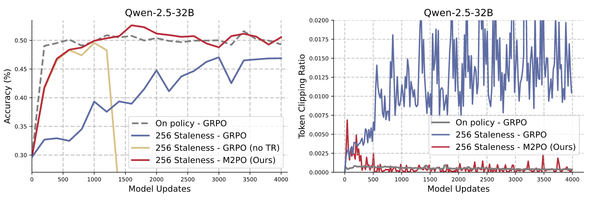

<div align="center">
<h1> Prosperity before Collapse: How Far Can Off-Policy RL Reach with Stale Data on LLMs? </h1>

Haizhong Zheng<sup>1</sup>, Jiawei Zhao<sup>2</sup>, Beidi Chen<sup>1</sup>
<br>
<sup>1</sup>Carnegie Mellon University,
<sup>2</sup>Meta AI

<div align="center">
[<a href="https://arxiv.org/abs/2510.01161">Paper</a>] | [<a href="https://infini-ai-lab.github.io/M2PO/">Blog</a>]
</div>
<br>

<!-- ---------- -->
**TL;DR**
Our work shows that stale data can be as informative as on-policy data if exploited properly.
We introduce **M2PO** (Second-Moment Trust Proxy Optimization), which constrains the second moment of importance weights to stabilize training.
Extensive evaluation across six model scales (1.7B–32B) demonstrates that M2PO achieves stable off-policy training even with data stale by at least 256 updates, matching on-policy performance.

</div>


## 🗞️ News

- **[2025.10.2]** Blog post released: [Prosperity Before Collapse – M2PO](https://infini-ai-lab.github.io/M2PO/).
- **[2025.10.2]** Paper preprint available on [arXiv](https://arxiv.org/abs/2510.01161).

<!-- ---------- -->
<p align="center">
  
</p>

<p align="center"><i>
<strong>Figure 1</strong> Comparison of on-policy GRPO and off-policy training under a staleness of 256 model updates on Qwen-2.5-32B.
<strong>Left:</strong> Standard GRPO suffers from degradation with stale rollouts, while removing the trust region (GRPO no TR) reveals a clear <em>prosperity-before-collapse</em> phenomenon.
In contrast, M2PO achieves stable training and matches on-policy performance even under high staleness.
<strong>Right:</strong> Token clipping ratio comparison shows that M2PO dramatically reduces clipping events compared to GRPO, while avoiding training collapse.</p>
</i></p>

<!-- ------- -->

<!-- The official implementation of M2PO will be released here soon! -->

## Getting Started
Our implementation is based on [volcengine/verl](https://github.com/volcengine/verl) (v0.4.0).

### 1. Environment Setup

```bash
cd project-folder

conda create -n verl05 python==3.11
conda activate verl05

git clone https://github.com/volcengine/verl.git
cd verl
USE_MEGATRON=0 bash scripts/install_vllm_sglang_mcore.sh
pip install latex2sympy2-extended
pip install math-verify

cd M2PO
pip3 install --no-deps -e .
```

### 2. Download & Preprocess Data

You can download the dataset using the following command:

```bash
# cd the project folder

bash train-scripts/generate_datasets.sh
```

### 3. Training

Train Qwen2.5 Math 7b with M2PO on 8xH100:

```bash
bash train-scripts/m2po-qwen-math-7b-s256.sh
```

```bash
bash train-scripts/grpo-qwen-math-7b-s0.sh
```

```bash
bash train-scripts/grpo-qwen-math-7b-s256.sh
```

See more scripts in `train-scripts` folder.
